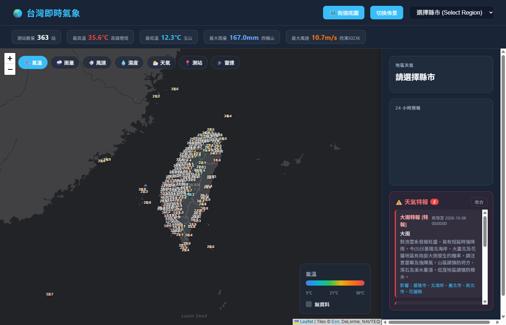

# 🌏 台灣即時氣象 (Taiwan Weather GIS)

一個即時顯示台灣各地氣象觀測資料的互動式網頁應用。後端以 **FastAPI** 串接中央氣象署 (CWA) 開放資料 API，前端以 **Leaflet** 地圖呈現測站級資料，並搭配 **Chart.js** 顯示 24 小時預報。

## 🚀 Live Demo

👉 **[https://taiwan-weather-gis-iota.vercel.app/](https://taiwan-weather-gis-iota.vercel.app/)**



## ✨ 功能特性

- **即時觀測資料**：全台灣氣象測站的氣溫、濕度、風速、風向、天氣現象
- **雨量資料**：獨立雨量測站 (O-A0002-001) 的 1 小時 / 3 小時 / 24 小時降雨量
- **互動式地圖**：Leaflet 地圖，可依不同圖層 (氣溫 / 雨量 / 風速 / 濕度 / 天氣 / 測站 / 雷達) 切換顯示
- **雷達圖**：整合 RainViewer 公開雷達合成圖
- **24 小時預報**：依縣市顯示溫度與降雨機率折線圖 (Chart.js)
- **天氣特報**：顯示中央氣象署發布的警報 / 特報 (W-C0033-002)
- **統計列**：測站數量、最高/最低溫、最大雨量、最大風速一覽
- **深色 / 淺色佈景** 與 **底圖切換** (深色 / 街道圖)
- **API 快取**：10 分鐘 TTL 快取，避免頻繁呼叫 CWA API

## 🏗️ 技術棧

| 層級 | 技術 |
|------|------|
| 後端框架 | FastAPI + Uvicorn |
| 資料驗證 | Pydantic |
| HTTP 客戶端 | httpx (async) |
| 快取 | cachetools (TTLCache) |
| 模板 | Jinja2 |
| 前端地圖 | Leaflet 1.9.4 |
| 前端圖表 | Chart.js |
| 部署 | Vercel (Serverless) |

## 📁 專案結構

```
AIoT_CWA/
├── app/
│   ├── main.py              # FastAPI 應用程式入口
│   ├── models/              # (保留) 資料模型
│   └── routers/
│       └── weather.py       # 氣象 API 路由與 CWA 資料處理
├── api/
│   └── index.py             # Vercel Serverless 入口
├── static/
│   ├── css/
│   │   ├── style.css        # 主樣式
│   │   └── tooltip.css      # 地圖 tooltip 樣式
│   ├── js/
│   │   ├── map.js           # 地圖渲染與圖層邏輯
│   │   └── weather.js       # 資料載入、統計、特報、圖表
│   └── geo/
│       └── taiwan-counties.geojson  # 台灣縣市邊界
├── templates/
│   └── index.html           # 主頁面
├── cwa_names.txt            # CWA 使用的縣市名稱
├── geo_names.txt            # GeoJSON 使用的縣市名稱
├── requirements.txt         # Python 相依套件
├── vercel.json              # Vercel 部署設定
└── .env                     # 環境變數 (API Key)
```

## 🚀 快速開始

### 1. 安裝相依套件

```bash
pip install -r requirements.txt
```

### 2. 設定環境變數

建立 `.env` 檔案並填入中央氣象署 API Key：

```env
CWA_API_KEY=你的CWA_API_KEY
# 選填：企業代理 MITM 環境下可關閉 SSL 驗證 (僅限本機測試)
CWA_VERIFY_SSL=true
```

> 取得 API Key：[中央氣象署開放資料平台](https://opendata.cwa.gov.tw/)

### 3. 啟動本機伺服器

```bash
uvicorn app.main:app --reload
```

開啟瀏覽器訪問 <http://127.0.0.1:8000>

## 🔌 API 端點

| 方法 | 路徑 | 說明 |
|------|------|------|
| GET | `/` | 主頁面 (HTML) |
| GET | `/api/health` | 健康檢查 |
| GET | `/api/weather` | 即時觀測 + 雨量 + 統計資料 |
| GET | `/api/forecast/{region_name}` | 指定縣市的 24 小時預報 |
| GET | `/api/warnings` | 天氣特報 / 警報 |

### 資料來源 (CWA Open Data)

| 資料集 | 說明 |
|--------|------|
| `O-A0003-001` | 即時氣象觀測資料 |
| `O-A0002-001` | 即時雨量觀測資料 |
| `F-C0032-001` | 36 小時天氣預報 |
| `W-C0033-002` | 天氣特報 |

## ⚙️ 部署至 Vercel

專案已包含 `vercel.json` 設定，可直接部署至 Vercel：

- 入口：`api/index.py` (使用 `@vercel/python` 建置)
- 靜態資源：`/static/*` 直接由 Vercel 提供
- 其餘路由皆轉發至 FastAPI 應用程式

部署時請在 Vercel 環境變數中設定 `CWA_API_KEY`。

## 📝 備註

- 後端對 CWA API 使用 **10 分鐘 TTL 快取**，以減少對上游 API 的呼叫頻率。
- 縣市名稱會經過正規化 (台→臺、桃園縣→桃園市) 以確保 CWA 與 GeoJSON 資料能正確對應。
- 雷達圖使用 [RainViewer](https://www.rainviewer.com/) 公開 API，為全球雷達合成圖。

## 📄 資料來源

- [中央氣象署開放資料平台](https://opendata.cwa.gov.tw/)
- [Leaflet](https://leafletjs.com/)
- [Chart.js](https://www.chartjs.org/)
- [RainViewer](https://www.rainviewer.com/)
